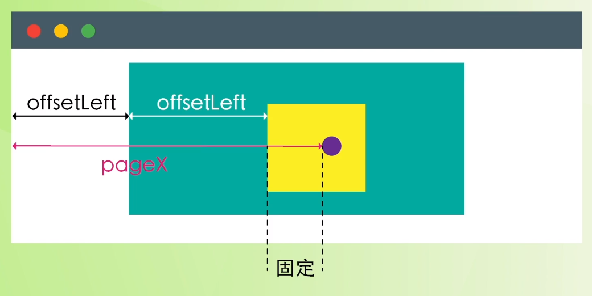

# JavaScript 拖拽功能 - Web 前端工程师面试题讲解

[JavaScript 拖拽功能 - Web 前端工程师面试题讲解](https://www.bilibili.com/video/BV1hf4y117Dp)

## tips

```html
<div draggable="true"></div>
```

|        |        |           |          |        |           |
| :----: | :----: | :-------: | :------: | :----: | :-------: |
|        | 开始时 | dragstart |          | 进入时 | dragenter |
| 拖动时 | 进行中 |   drag    | 进入区域 | 进入后 | dragover  |
|        |  结束  |  dragend  |          |  离开  | dragleave |
|        |        |           |          |  放置  |   drop    |

`<section></section>`区段标签

### css padding margin border 缩小

```css
box-sizing: border-box;
```

### addEventListener

```js
target.addEventListener(type, listener, options)
```

### querySelector 不能为数字开头

```js
document.querySelector('')
```

### 鼠标事件

| 鼠标按下  | 鼠标移动  | 鼠标松开 |
| --------- | --------- | -------- |
| mousedown | mousemove | mouseup  |


